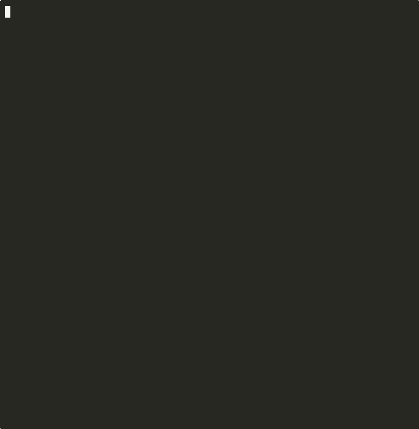

  

# OWASP Agent Memory Guard

### 📦 14,000+ total downloads

    

  

  🏆 <strong>Officially recognized as an OWASP Incubator Project</strong>

  <strong>Stop AI agents from being weaponized through their own memory.</strong> 
  Runtime defense that catches memory poisoning — even after a context reset.

---

> **⭐ If you find this project useful for securing your AI agents, please consider giving it a star on GitHub! It helps others discover the project.**

  

  <a href="https://vgudur-amg-memory-poisoning-lab.hf.space/"><strong>▶ Try the live Memory Poisoning Lab</strong></a> — run a representative attack-and-block scenario in your browser.

  
