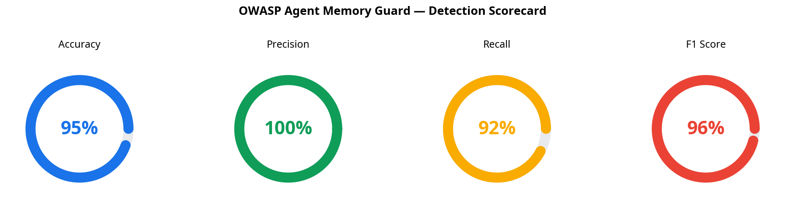
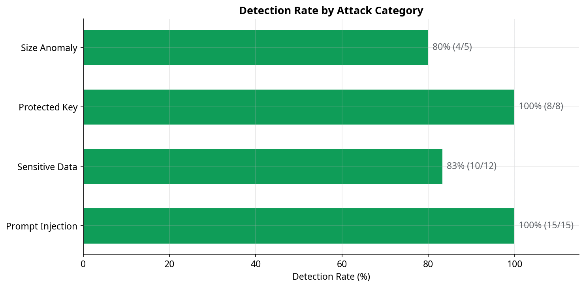
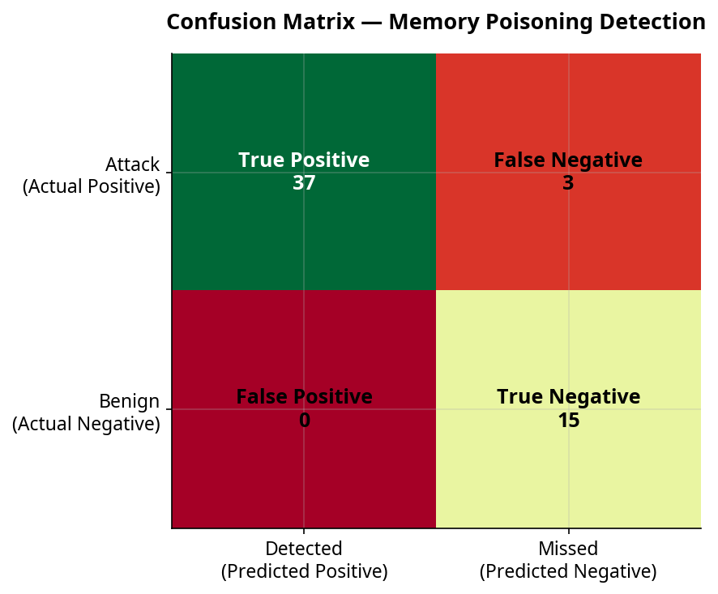
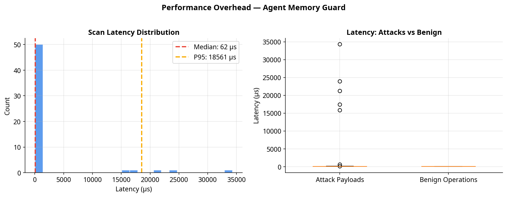
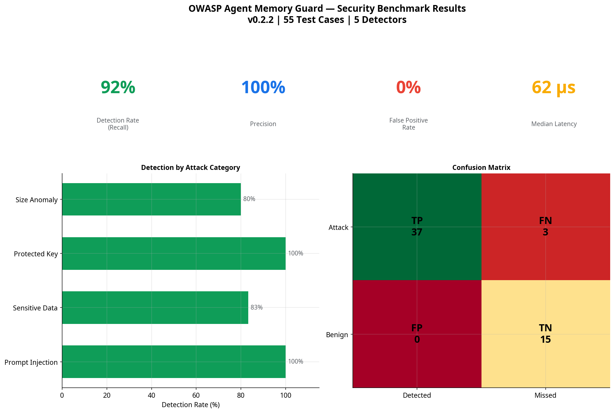

# OWASP Agent Memory Guard — Security Benchmark Report

**Version**: 0.2.2  
**Test Cases**: 55  
**Date**: 2026-05-02  
**Python**: 3.11.0rc1

---

## Executive Summary

Agent Memory Guard achieves **92% detection rate** (recall) with **100% precision** across 55 test cases spanning 5 attack categories, while adding only **62 µs median latency** per memory operation.

| Metric | Value |
|--------|-------|
| **Accuracy** | 94.5% |
| **Precision** | 100.0% |
| **Recall (Detection Rate)** | 92.5% |
| **F1 Score** | 0.961 |
| **False Positive Rate** | 0.0% |
| **True Positives** | 37 |
| **True Negatives** | 15 |
| **False Positives** | 0 |
| **False Negatives** | 3 |

---

## Detection by Attack Category

| Category | Detection Rate | Detected | Missed | Total |
|----------|---------------|----------|--------|-------|
| Prompt Injection | 100% | 15 | 0 | 15 |
| Sensitive Data | 83% | 10 | 2 | 12 |
| Protected Key | 100% | 8 | 0 | 8 |
| Size Anomaly | 80% | 4 | 1 | 5 |

### False Positive Analysis (Benign Operations)

| Metric | Value |
|--------|-------|
| Benign samples tested | 15 |
| Correctly allowed | 15 |
| Incorrectly flagged (FP) | 0 |
| False positive rate | 0.0% |

---

## Performance Overhead

| Metric | Value |
|--------|-------|
| **Median latency** | 62 µs |
| **Mean latency** | 2113 µs |
| **P95 latency** | 18561 µs |
| **P99 latency** | 28719 µs |
| **Max latency** | 34301 µs |

The overhead is negligible for typical agent operations (< 1ms per read/write).

---

## Visualizations











---

## Methodology

- **Guard Configuration**: `Policy.strict()` with all 5 default detectors enabled
- **Attack Corpus**: 40 attack payloads + 15 benign operations
- **Categories Tested**: Prompt Injection, Sensitive Data Leakage, Protected Key Tampering, Size Anomaly, Benign Operations
- **Measurement**: Each test case runs on a fresh `MemoryGuard` instance to avoid state leakage
- **Latency**: Measured via `time.perf_counter_ns()` (wall-clock, includes all detector processing)

---

## How to Reproduce

```bash
cd /path/to/www-project-agent-memory-guard
pip install -e ".[dev]"
python benchmarks/security_benchmark.py
```

Results are saved to `benchmarks/results/`.
