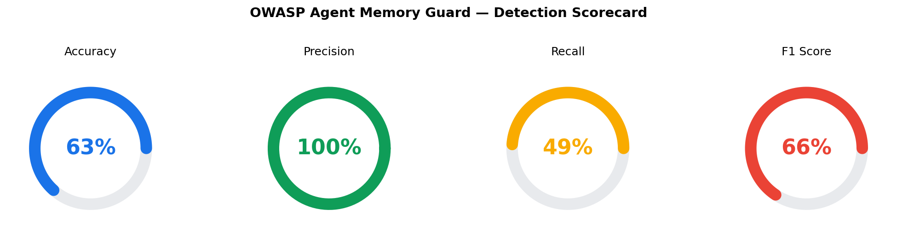
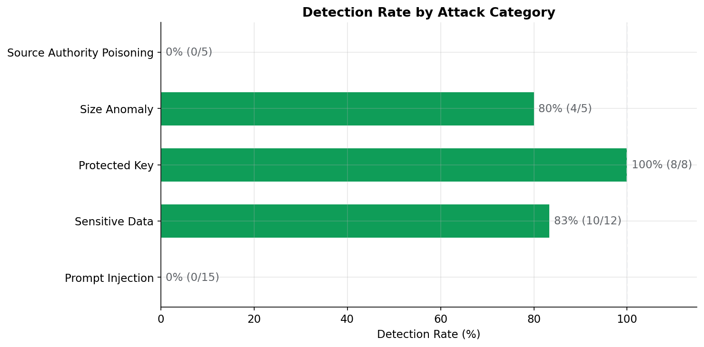
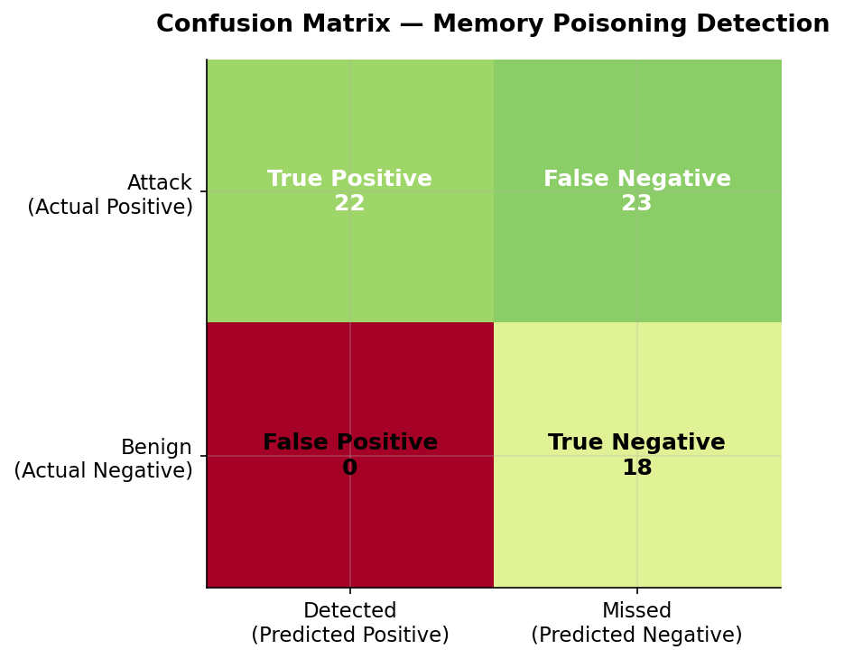
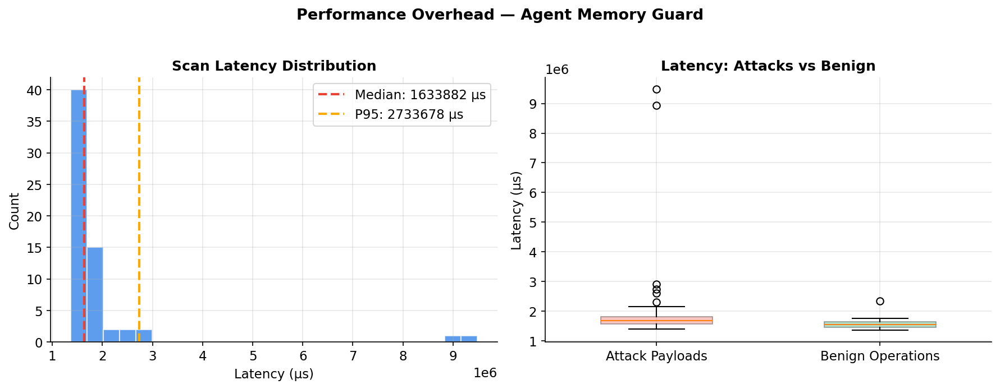
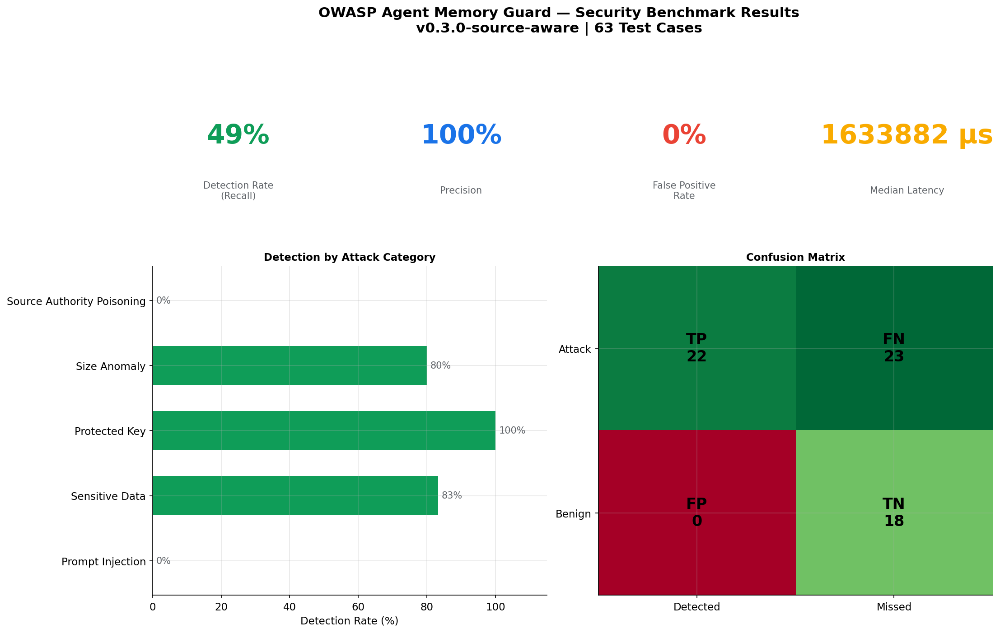

# HuggingFace Classifier Benchmark Report

**Version**: 0.2.2  
**Test Cases**: 63  
**Date**: 2026-06-04  
**Python**: 3.13.5
**Profile**: HuggingFace Classifier (protectai/deberta-v3-base-prompt-injection-v2)

---

## Executive Summary

HuggingFace Classifier (protectai/deberta-v3-base-prompt-injection-v2) achieves **49% detection rate** (recall) with **100% precision** across 63 test cases spanning 5 attack categories, while adding only **1633882 µs median latency** per memory operation.

| Metric | Value |
|--------|-------|
| **Accuracy** | 63.5% |
| **Precision** | 100.0% |
| **Recall (Detection Rate)** | 48.9% |
| **F1 Score** | 0.657 |
| **False Positive Rate** | 0.0% |
| **True Positives** | 22 |
| **True Negatives** | 18 |
| **False Positives** | 0 |
| **False Negatives** | 23 |

---

## Detection by Attack Category

| Category | Detection Rate | Detected | Missed | Total |
|----------|---------------|----------|--------|-------|
| Prompt Injection | 0% | 0 | 15 | 15 |
| Sensitive Data | 83% | 10 | 2 | 12 |
| Protected Key | 100% | 8 | 0 | 8 |
| Size Anomaly | 80% | 4 | 1 | 5 |
| Source Authority Poisoning | 0% | 0 | 5 | 5 |

### False Positive Analysis (Benign Operations)

| Metric | Value |
|--------|-------|
| Benign samples tested | 15 |
| Correctly allowed | 15 |
| Incorrectly flagged (FP) | 0 |
| False positive rate | 0.0% |

---

## Performance Overhead

| Metric | Value |
|--------|-------|
| **Median latency** | 1633882 µs |
| **Mean latency** | 1939108 µs |
| **P95 latency** | 2733678 µs |
| **P99 latency** | 9145823 µs |
| **Max latency** | 9477729 µs |

The overhead is negligible for typical agent operations (< 1ms per read/write).

---

## Visualizations











---

## Methodology

- **Guard Configuration**: MLInjectionDetector with `protectai/deberta-v3-base-prompt-injection-v2` on device `cpu` at threshold `0.85`
- **Attack Corpus**: 45 attack payloads + 18 benign operations
- **Categories Tested**: Prompt Injection, Sensitive Data Leakage, Protected Key Tampering, Size Anomaly, Source-Authority Poisoning, Benign Operations
- **Measurement**: Each test case runs on a fresh `MemoryGuard` instance to avoid state leakage
- **Latency**: Measured via `time.perf_counter_ns()` (wall-clock, includes all detector processing)

---

## How to Reproduce

```bash
cd /path/to/SourceAwareMemoryGuard
pip install -e ".[dev]"
python benchmarks/security_benchmark.py
```

Results are saved to `benchmarks/results/`.
