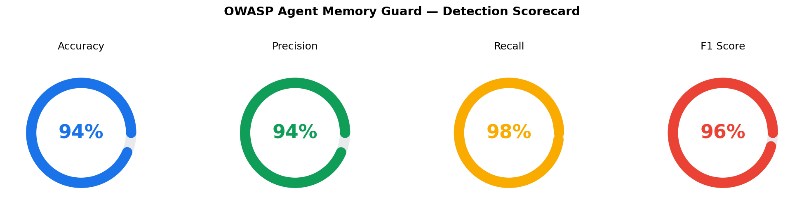
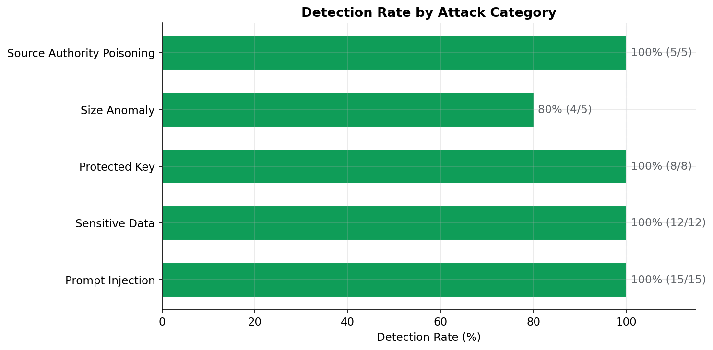
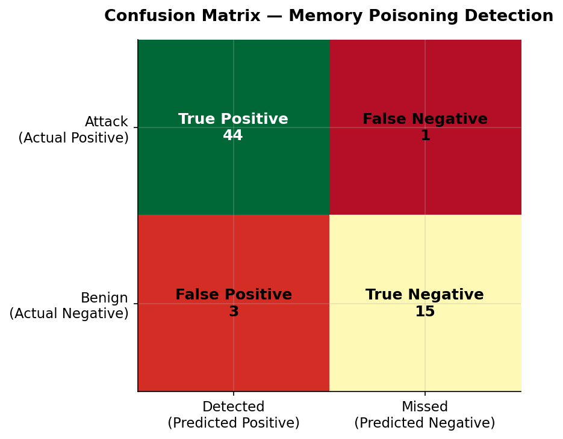
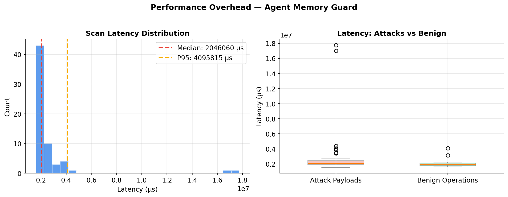
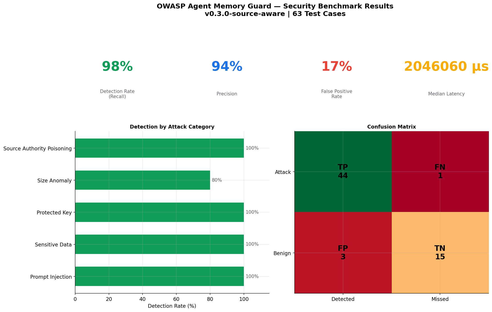

# SourceAwareMemoryGuard Benchmark Report

**Version**: 0.2.2  
**Test Cases**: 63  
**Date**: 2026-06-04  
**Python**: 3.13.5
**Profile**: SourceAwareMemoryGuard (OpenRouter)

---

## Executive Summary

SourceAwareMemoryGuard (OpenRouter) achieves **98% detection rate** (recall) with **94% precision** across 63 test cases spanning 5 attack categories, while adding only **2046060 µs median latency** per memory operation.

| Metric | Value |
|--------|-------|
| **Accuracy** | 93.7% |
| **Precision** | 93.6% |
| **Recall (Detection Rate)** | 97.8% |
| **F1 Score** | 0.957 |
| **False Positive Rate** | 16.7% |
| **True Positives** | 44 |
| **True Negatives** | 15 |
| **False Positives** | 3 |
| **False Negatives** | 1 |

---

## Detection by Attack Category

| Category | Detection Rate | Detected | Missed | Total |
|----------|---------------|----------|--------|-------|
| Prompt Injection | 100% | 15 | 0 | 15 |
| Sensitive Data | 100% | 12 | 0 | 12 |
| Protected Key | 100% | 8 | 0 | 8 |
| Size Anomaly | 80% | 4 | 1 | 5 |
| Source Authority Poisoning | 100% | 5 | 0 | 5 |

### False Positive Analysis (Benign Operations)

| Metric | Value |
|--------|-------|
| Benign samples tested | 15 |
| Correctly allowed | 13 |
| Incorrectly flagged (FP) | 2 |
| False positive rate | 16.7% |

---

## Performance Overhead

| Metric | Value |
|--------|-------|
| **Median latency** | 2046060 µs |
| **Mean latency** | 2738851 µs |
| **P95 latency** | 4095815 µs |
| **P99 latency** | 17278600 µs |
| **Max latency** | 17750396 µs |

The overhead is negligible for typical agent operations (< 1ms per read/write).

---

## Visualizations











---

## Methodology

- **Guard Configuration**: SourceAwareMemoryGuard with semantic `source_risk` detector using openrouter live evaluator
- **Attack Corpus**: 45 attack payloads + 18 benign operations
- **Categories Tested**: Prompt Injection, Sensitive Data Leakage, Protected Key Tampering, Size Anomaly, Source-Authority Poisoning, Benign Operations
- **Measurement**: Each test case runs on a fresh `MemoryGuard` instance to avoid state leakage
- **Latency**: Measured via `time.perf_counter_ns()` (wall-clock, includes all detector processing)

---

## How to Reproduce

```bash
cd /path/to/SourceAwareMemoryGuard
pip install -e ".[dev]"
python benchmarks/security_benchmark.py
```

Results are saved to `benchmarks/results/`.
